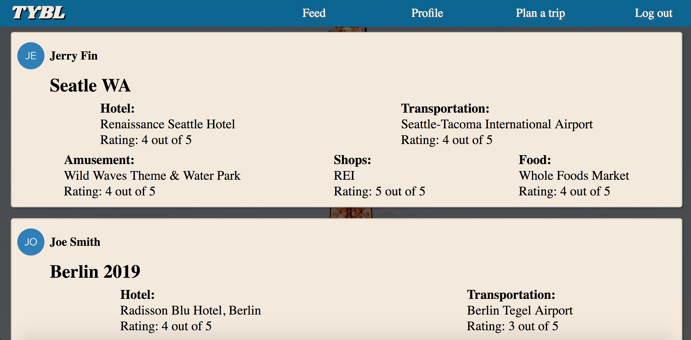
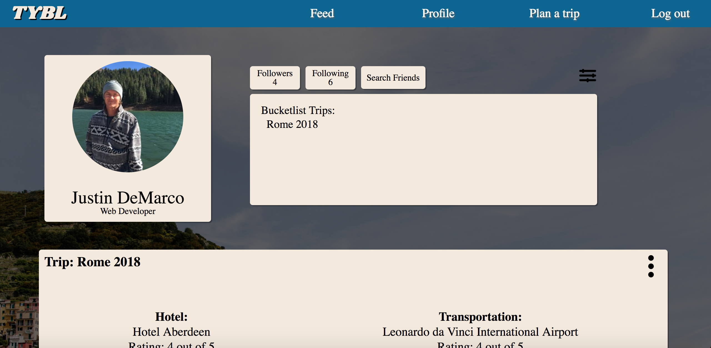
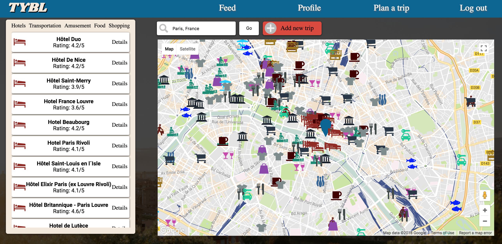

<h1>TYBL Project</h1>

<h2>Description</h2>
Tybl is a Fullstack Web Application. A travel planning app that allows users to share and plan trips with other users. In TYBL you can follow a user, when following that user your feed will populate with their recent trips.

<a href="https://www.youtube.com/watch?v=1pkumOKu8VY&t=4s">**Video walktrough**</a>

<h2>Tech used</h2>
<ul>
    <li>Built with React, Redux, Node, Express, PostgresQL, Auth0.</li>
    <li>Used Google Maps, Google Places, Google Place Details and Google Photos API to get information on hotels, attractions, transportation, restaurants, and shopping destinations.</li>
    <li>Used AuthO to login and automatically create user profiles.</li>
</ul>

<h2>Feed View</h2>

The trips shown on your feed are only trips from users that you follow and have all the data filled in. When a you unfollow a user their trips remove from your feed as well.

<h2>Profile</h2>

Your drafts and finished trips will be shown in most recent order. Within the trip you can delete single locations or you can delete the whole trip. The user can update thier Profile image, Description, and Username. 

<h2>Plan A Trip</h2>

Plan a trip is were you can add all the locations to your trip. 
